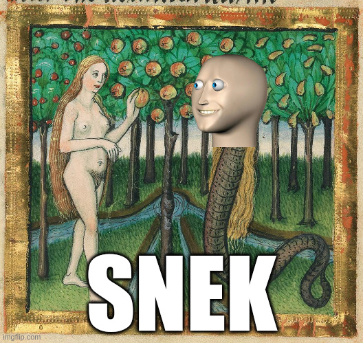

# snek

A plain and simple implementation of [Snake](https://en.wikipedia.org/wiki/Snake_(video_game_genre)).

Image: The fall of man in [The Furtmeyr Bible p. 24](https://www.loc.gov/resource/gdcwdl.wdl_08924/?sp=24&r=0.22,0.679,0.835,0.336,0), now [ready for memefication](https://imgflip.com/memegenerator/505951636/The-fall-of-man)

## Installation

Run `snek` without installing:

    nix-shell https://github.com/fricklerhandwerk/snek/tarball/master -A shell --run snek

## Controls

- arrow keys: change direction
- `Backspace`: restart game
- `Escape`: quit program

## Development

Clone and enter the repository:

    git clone https://github.com/fricklerhandwerk/snek
    cd snek

Start a development shell:

    nix-shell

Or set up [`nix-direnv`](https://github.com/nix-community/nix-direnv) on your system and run `direnv allow` to enter the development environment automatically when changing into the project directory.

Run the game and restart when any file in the repository changes:

    test-loop

> **Note**
>
> Window resize events are not handled in the `test-loop` because `watchexec` seems to swallow them, and will lead to a crash.
> Use `python -m snek.main` directly to test window resizing.
